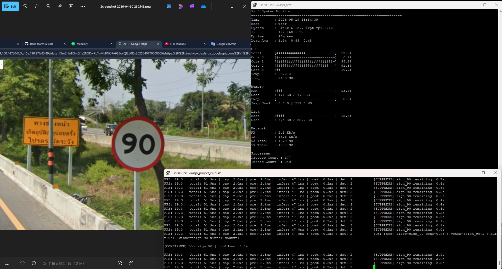
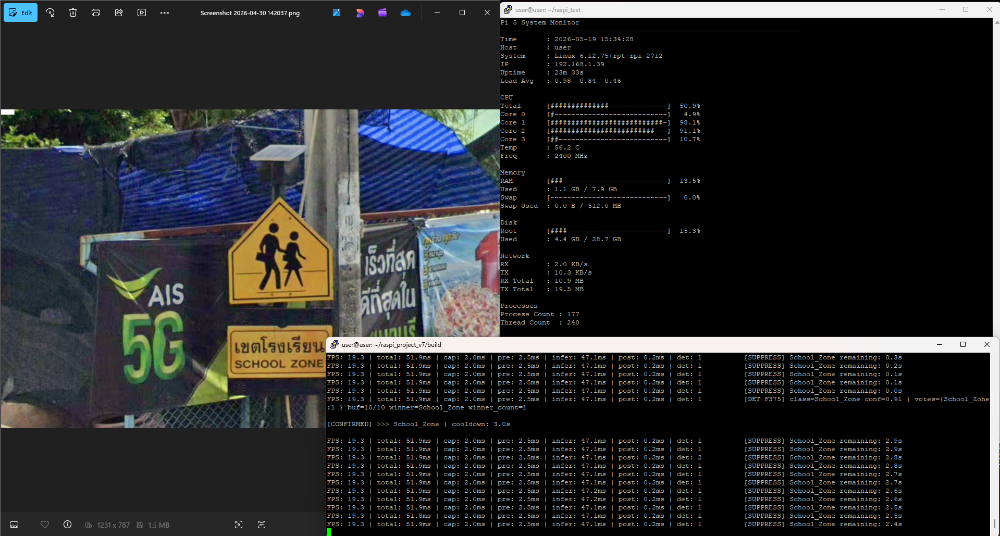
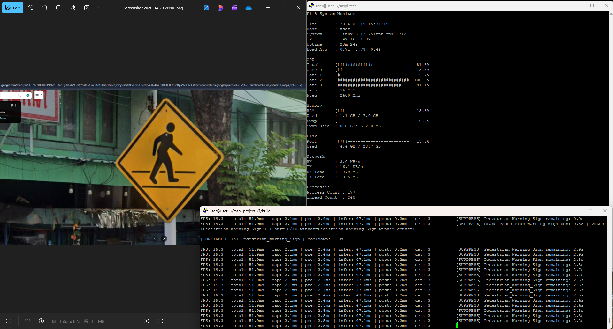
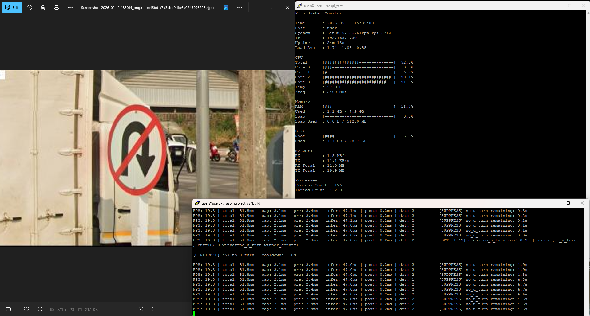
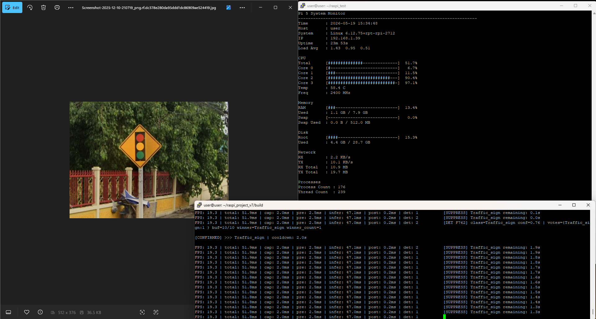
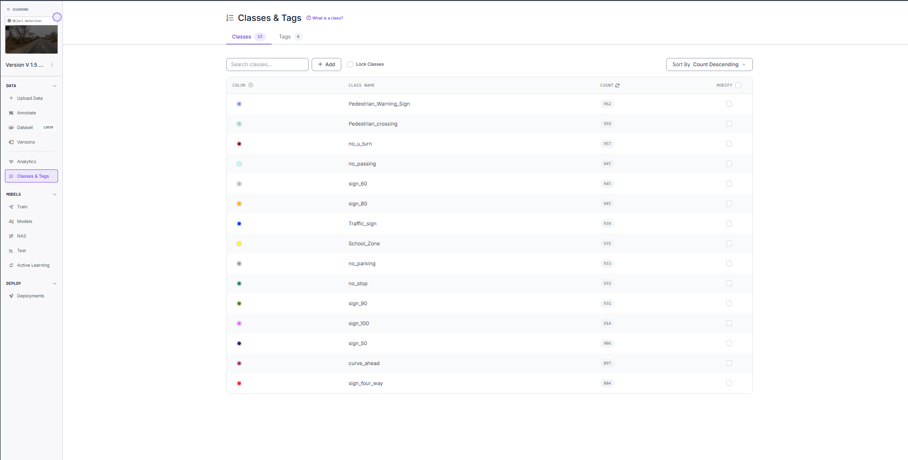
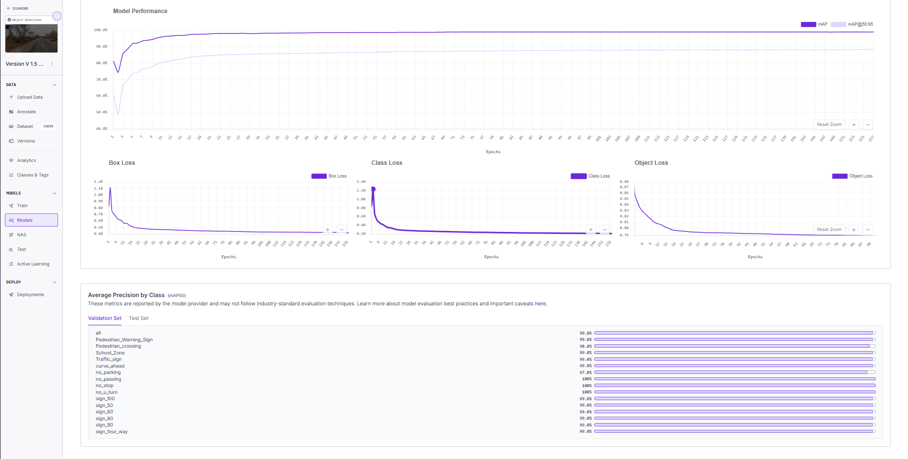
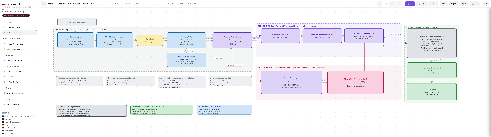

<!--
  README — Embedded AI Systems Engineering case study. Narrative priority:
  embedded deployment engineering > ML metrics. Locked facts: FPS quoted as ~18;
  model = fp32 (fp16 storage/packed on, NOT fp16 arithmetic); repo slug → raspi-cognitive-adas.
  TODO markers = data the saved notes never captured (fill before publishing).
-->

# DualVision — Embedded Cognitive Driver Assistance on Raspberry Pi 5


**A DualVision traffic-sign & driver-monitoring assistant — fully on-device, on a Raspberry Pi 5.**

> This is **not** "I trained YOLO and ran it on a Pi." It is a year-long study of **deployment engineering under constrained hardware**: backend characterization, low-precision inference investigation, post-export validation, runtime benchmarking, and a cognitive decision architecture that decides *whether the driver should be interrupted at all*. The system performs **attention redirection** for a human-in-the-loop driver — it does not drive.

*"DualVision" = a dual-camera design — a forward traffic-sign camera (built) plus a **planned** driver-monitoring camera (§14). Only the traffic-sign vision is implemented today; this is not a stereo rig.*



*Live on-device detection (speed-limit 90) with the runtime telemetry panel + decision log, on the Raspberry Pi 5.*

🎥 **Demo (with audio):** the system's whole point is that it **speaks** — so the live demo is a **video with sound**, not a silent GIF.
<!-- TODO: on github.com, edit this README and DRAG demo/Video.mp4 into the editor (or attach it
     to a Release). GitHub hosts it and renders an inline player WITH audio — paste the resulting
     https://github.com/<user>/<repo>/assets/... URL on the line above. (Do NOT use a GIF: no sound.) -->

**More on-device detections:**

| | |
|---|---|
|  |  |
|  |  |

---

## 1. Overview

A real-time, **offline** edge-AI assistant on a Raspberry Pi 5. A forward camera detects and reads traffic signs; an audio channel speaks **only** what deserves the driver's attention. The engineering thesis is a **cognitive attention scheduler** — the contended resource is the **driver's attention** (one spoken notification at a time), not CPU. Perception, decision, and audio all run **on-device, with no cloud or network dependency**.

The central question shifted from *"can I detect more signs?"* to ***"which information deserves the driver's attention right now?"***

---

## 2. Design Evolution Timeline

This repository is the **full engineering journey**, not just the final system. Each early phase is preserved as a code folder; **v2.2 is the latest architecture redesign built on top of v1.7 — the same project, evolved, not a separate one.**

### Phase 1 — Detection pipeline & edge optimization (v1.1 → v1.7)
| Version | Milestone | Code |
|---|---|---|
| v1.1 | Initial ONNX inference pipeline | [`version_1.1_initial_onnx/`](version_1.1_initial_onnx) |
| v1.2 | Modular ONNX architecture | [`version_1.2_modular_pipeline/`](version_1.2_modular_pipeline) |
| v1.3 | Migrated to NCNN backend | [`version_1.3_initial_ncnn/`](version_1.3_initial_ncnn) |
| v1.4 | Frame-saving pipeline | [`version_1.4_ncnn_save_frames/`](version_1.4_ncnn_save_frames) |
| v1.5 | RGB/BGR pipeline optimization | [`version_1.5_rgb_bgr_pipeline_debug/`](version_1.5_rgb_bgr_pipeline_debug) |
| v1.6 | NCNN preprocessing (RGB/BGR) fix | [`version_1.6_rgb_bgr_fix/`](version_1.6_rgb_bgr_fix) |
| v1.7 | Temporal voting + cooldown stabilization | [`version_1.7_temporal_voting_cooldown/`](version_1.7_temporal_voting_cooldown) |

Phase 1 took the system from a first ONNX detection pipeline to a stable, NCNN-optimized, temporally-voted detector on the Pi — including the backend migration (§9) and the RGB/BGR fix (§12).

### Phase 2 — Cognitive architecture redesign (v2.2, current)
The latest chapter rebuilds the **decision layer** on top of the v1.7 detection base: belief-state speed tracking (L1–L4), a second "momentary" engine for the non-speed signs, and cognitive attention arbitration (§5–§6). The question shifted from *"detect more signs"* to *"which information deserves the driver's attention."* **Same system — re-architected.** (`version_2.2_cls_roi_debug/`)

---

## 3. Dataset

| | |
|---|---|
| Labeled images | **13,039** |
| Classes | **15** traffic-sign classes |
| Balance | ~**884–962** per class (balanced) |
| Test split | 1,300 images / 1,398 boxes |
| Source | Roboflow |

*13,039 is the **usable, labeled** image count; unusable captures were excluded rather than annotated.*

**Classes:** Pedestrian_Warning_Sign · Pedestrian_crossing · School_Zone · Traffic_sign · curve_ahead · no_parking · no_passing · no_stop · no_u_turn · sign_100 · sign_50 · sign_60 · sign_80 · sign_90 · sign_four_way.



### Training performance (Roboflow validation set)
| mAP50 | Precision | Recall | F1 |
|---|---|---|---|
| 99.1% | 98.5% | 98.4% | 98.4% |



*These are **training-platform** numbers (Roboflow val set, platform default confidence). For the **post-export, deployment-threshold** verification on the held-out test split, see §11 — that is the number that reflects what actually runs on the Pi.*

---

## 4. Two-Stage Perception

Authority is split on purpose — **YOLO owns *where*, the classifier owns *what*:**

- **Stage 1 — YOLO11 Nano detector** (imgsz **512**): detects sign **presence + region (ROI)** only. Its sub-class is treated as unstable and is *not* trusted for the value.
- **Stage 2 — Speed classifier (CLS)**: reads the actual **value** (50/60/80/90/100) from the confirmed ROI, only at a confirm event.

Camera runtime resolution **960×560**. Separating presence (YOLO) from value (CLS) is the core perception redesign that makes the belief-state tracking below robust to flicker.

---

## 5. Cognitive Driver Assistance Architecture

Two decision engines feed one arbiter and one speaker:

```
Camera → YOLO (presence+ROI) ─┐
                              ├─ TemporalVoter → BehaviorPolicyRouter
            CLS (value) ──────┘                      │
                                   ┌──────────────────┴───────────────────┐
                          Engine A (speed: L1→L2→L3)        Engine B (momentary)
                                   └──────────────────┬───────────────────┘
                                          Notification Arbiter (attention_rank, preempt)
                                                       │
                                              shared L4 (single-slot, latest-wins)
                                                       │
                                                   🔊 Speaker
```

**Engine A — Persistent-State (speed limits).** The current speed limit is a **belief to be estimated**, not a per-frame output:

| Layer | Responsibility |
|---|---|
| **L1** `SignEpisodeLifecycle` | raw presence; Armed→Confirmed→Releasing; re-arm; emits `EpisodeConfirmed{value, fresh}` |
| **L2** `CurrentSpeedLimitManager` | UNKNOWN/ACTIVE belief; commit on value change with K-hysteresis; **no-forget** |
| **L3** `AnnouncementPolicy` | CHANGE / REMINDER / SUPPRESS; global reminder cooldown (180 s) |
| **L4** `NotificationManager` | action→wav; single-slot latest-wins; `aplay` on a dedicated thread |

**Engine B — Momentary** (10 non-speed signs) has **no episode lifecycle** — a per-class "human-memory suppression" model: `now − last_notified[class] ≥ suppression_window[class]` → else suppress. Momentary info has no second chance (drive past → gone) so it **may interrupt**; persistent state is re-derivable so it does not.

The **Notification Arbiter** resolves the single-speaker conflict on one axis (`attention_rank`): life-safety signs may **kill a playing clip** (preempt) and a preempted speed CHANGE is **re-delivered** from the *current* belief once the channel frees.



📐 **Interactive viewer:** <!-- TODO: enable GitHub Pages → --> `https://triphet-dm.github.io/raspi-cognitive-adas/ARCHITECTURE_VIEWER.html` (11 boards, super-system overview → per-layer state machines).

---

## 6. Behavioral Design — the 8 Laws

The decision layer is governed by explicit behavioural laws. Meta-principle: **maximize driver comprehension, not information delivery.**

1. **You don't have to say everything** — report all ⇒ the driver stops listening.
2. **Life-safety signs override everything** — human safety > communication consistency (only the safety tier may interrupt).
3. **One episode = one notification** — long visibility ≠ repeat.
4. **No queue anywhere** — drop stale, re-derive from current state.
5. **Truth validation belongs to perception** — the behaviour layer does not re-validate perception truth.
6. **The driver's intake is limited** — usually speak one thing at a time.
7. **Reliability is everything (anti cry-wolf)** — false alarms train the driver to ignore us.
8. **Machine attention is intentionally limited** — behave as if the machine can focus on only one important thing at a time.

---

## 7. Key Engineering Decisions

The calls that shaped the system — each backed by measurement (evidence in §8–§12):

- **NCNN over ONNX Runtime** — chosen *after* on-Pi backend benchmarking (~1.8× throughput using fewer threads), not by default.
- **Rejected INT8** — on real hardware it ran *slower* on the Cortex-A76 CPU; theory said faster, measurement said no.
- **Sync over async pipeline** — async *degraded* throughput ~2× under this workload (capture thread starved inference).
- **Capped inference at 2 threads** — 3–4 threads add ~1–2 FPS; the marginal core is reserved for the planned driver-monitoring model (systems decision, not benchmark-chasing).
- **Split perception: YOLO (ROI) + classifier (value authority)** — robust to YOLO's unstable sub-class under flicker.
- **Cognitive attention arbitration** instead of naive sequential alerts — the contended resource is the *driver's attention*, not CPU.

---

## 8. Deployment Benchmarking

All numbers use the **same YOLO11n model at imgsz 512** — only platform/backend/config changes.

**At a glance (peak FPS):**
- Desktop ONNX — **~170 FPS** *(RTX 4070 Super, GPU — dev box only)*
- Desktop PyTorch — ~110 FPS *(GPU — dev box only)*
- **Pi 5 NCNN — ~18 FPS** *(CPU — the deployment target)*
- Pi 5 ONNX Runtime — ~10 FPS *(CPU)*

*The desktop figures are a GPU dev box — not a fair hardware comparison to the Pi; the deployment target is the Pi 5 **CPU**.*

### Desktop — NVIDIA RTX 4070 Super (GPU)
| Format | FPS |
|---|---|
| `best.pt` (PyTorch) | 97–110 |
| `best.onnx` (ONNX Runtime) | 145–170 |

### Raspberry Pi 5 — ONNX Runtime
| Threads | FPS | Infer |
|---|---|---|
| 1 | 4.6 | 208 ms |
| 2 | 7.9 | 119 ms |
| 3 | 9.8 | 93 ms |
| 4 | 10.0 | 89 ms |

### Raspberry Pi 5 — NCNN (production backend)
Production config: **fp32 compute · `use_fp16_storage` ON · `use_fp16_packed` ON** (fp16 = memory-format/bandwidth optimization, **not** fp16 arithmetic; compute stays fp32).

| Config | FPS | Infer |
|---|---|---|
| fp32 + packing **ON** | **18.3** | 47.8 ms |
| fp32 + packing OFF | 13.8 | 66.9 ms |
| int8 | ~1–3 FPS **slower** | 51.2 ms |
| fp16 arithmetic | no speed gain | accuracy ↓ |

NCNN thread scaling: 1 → 12.9 · 2 → **18.0** · 3 → 19.7 · 4 → 20.2 FPS.

---

## 9. Backend Characterization

What the benchmarks above actually reveal:

- **NCNN ≫ ONNX Runtime on ARM** — NCNN at **2 threads (18 FPS)** beats ONNX at **4 threads (10 FPS)**: ~**1.8×** throughput using *fewer* cores.
- **ONNX Runtime saturates after 3 threads** — 3→4 gains almost nothing (9.8→10 FPS): **thread saturation**.
- **NCNN packing is critical** — disabling packing drops 18.3 → 13.8 FPS (**−32%**). The fp16 memory layout, not arithmetic precision, is doing the work.
- **GPU note:** on desktop, ONNX beats PyTorch under **GPU acceleration** (CUDA EP / graph optimization & kernel fusion) — an inference-engine difference, not just framework overhead.

---

## 10. Low-Precision Inference Investigation

The interesting result is a **negative** one — theoretical acceleration that *failed* on this hardware, and why.

- **INT8 detects correctly on the Pi but runs *slower*** than the optimized fp32 path (51.2 ms vs 47.8 ms; ~1–3 FPS down). It fails its only purpose, which was speed.
  - *Why:* the Cortex-A76 already runs fp32+fp16 NEON efficiently, and per-layer quantize/dequantize overhead costs more than the int8 compute saves. INT8 only beat fp32 when fp16 was **force-disabled** — which deployment never does.
  - *Subtlety found:* an earlier Windows `ncnn-python` run showed int8 at "0 true positives"; that was an **x86 int8-kernel artifact** — on the actual ARM Pi the int8 model detects fine. The Pi is the ground truth.
- **FP16 arithmetic is a no-op here** — enabling it gave **no speed gain** and **lowered accuracy**. The fp16 win is purely **storage/packed (memory bandwidth)**, a different optimization from fp16 *arithmetic*.
- **Where int8 *would* pay off:** only with a dedicated accelerator (Pi AI HAT / Hailo NPU, Coral Edge TPU) — those are int8-native. The calibration assets are kept for that path.

**Decision:** stay on **fp32 + fp16 storage/packing** on the Pi 5 CPU. Pursue further speed via imgsz or an accelerator, not precision.

---

## 11. Model Evaluation Consistency

The model is **not judged on training-platform metrics alone.** The key check is whether accuracy survives the **export to the deployed artifact**, measured at the *exact* runtime thresholds (`conf = 0.45`, `iou = 0.45`) on the held-out test split:

| Evaluation (test split @ conf 0.45) | mAP50 | Precision | Recall | mAP50-95 |
|---|---|---|---|---|
| `best.pt` (PyTorch) | 0.982 | 0.980 | 0.965 | 0.907 |
| **NCNN export — deployed artifact** | **0.980** | **0.977** | **0.966** | **0.906** |
| **Δ (export effect)** | −0.002 | −0.003 | +0.001 | −0.001 |
| Roboflow validation *(reference)* | 0.991 | 0.985 | 0.984 | — |

Across the PyTorch → NCNN export boundary — **same test split, same deployment thresholds** — every metric moved by **≤ 0.3 %**. The NCNN artifact validated here is **md5-identical** to the one running on the Pi, so this is genuine **post-export, deployment-equivalent verification**, not a dashboard number.

*Caveats (stated honestly):* the Roboflow row is a **different split (val) at the platform's default confidence**, so treat it as a reference, not a like-for-like delta. All splits are from one Roboflow collection (**in-distribution** → an upper bound); final validation is an on-Pi real-camera soak.

---

## 12. Engineering Challenges Solved

Three non-trivial debugging discoveries — failures and dead-ends are part of the record:

1. **Async pipeline was *slower* than sync** under this workload — the async capture thread ran flat-out and starved inference on the 4-core Pi 5 (~2× throughput loss). Production runs **sync**.
2. **INT8 under NCNN was slower than the optimized fp32 path** on the Pi 5 (see §10) — theoretical acceleration that didn't survive contact with the hardware.
3. **BGR/RGB channel mismatch** corrupted the color pipeline and changed model behaviour — a subtle, high-impact preprocessing bug.

Plus: embedded-Python (Picamera2) GIL management, NCNN thread benchmarking, and dropped-frame handling under CPU contention.

---

## 13. Hardware Stack

| Item | Detail |
|---|---|
| Compute | Raspberry Pi 5 (8 GB) |
| Camera | Raspberry Pi **HQ Camera (IMX477)** + **16 mm telephoto lens** |
| Capture | Picamera2, 960×560, sync read on the main thread |
| Amplifier | MAX98357A (I²S) |
| Speaker | 3 W |
| Cooling | Official Active Cooling Fan |


*Power delivery (automotive supply / DC-DC) is not finalized and is intentionally left unspecified. A secondary driver-monitoring camera is planned (§14).*
<!-- TODO: optional I²S wiring/pinout note. -->

---

## 14. Limitations & Future Work

- **Camera-only staleness** — the no-forget belief can be wrong after turning onto an unsigned road (no map/GPS). Surfaced via `age()` telemetry. *Future: GPS / map context.*
- **Driver monitoring (drowsiness)** — the second DualVision camera is designed but **not built**. Priority will be driver > signs (Laws 2 + 8).
- **Thermal management** — a sun-soaked parked cabin can throttle the Pi 5; planned **Thermal Governor** (hysteresis + graceful FPS degradation, never gating drowsiness).
- **Suppression-window tuning** — current per-class windows are provisional pending an on-Pi real-camera soak.

---

## 15. Build & Run

> Code currently lives under `version_2.2_cls_roi_debug/raspi_project_v11/`. <!-- TODO: flatten before publishing (mind CMake paths). -->

**Prerequisites (Pi 5):** NCNN (so CMake finds `ncnnConfig.cmake`), OpenCV, Python3 dev (Picamera2), a C++17 toolchain.

**1. Export the model** (on the training machine — models are not in the repo, see §16):
```bash
yolo export model=best.pt format=ncnn imgsz=512 half=False dynamic=False
# copy the .param/.bin into src/models/
```

**2. Build:**
```bash
cd version_2.2_cls_roi_debug/raspi_project_v11
mkdir -p build && cd build
cmake ..            # or: cmake .. -Dncnn_DIR=/path/to/ncnn/lib/cmake/ncnn
make -j4
```

**3. Run (production operating point — sync, 512, threads = 2, audio on):**
```bash
./app --threads 2 --audio
```

| Flag | Purpose |
|---|---|
| `--threads <n>` | NCNN inference threads (**2** = production) |
| `--audio` / `--audio-dir <dir>` / `--audio-device <dev>` | enable audio · WAV dir · ALSA device |
| `--shadow-k <n>` | L2 K-hysteresis (default **2**) |
| `--shadow-rearm-ms <ms>` / `--shadow-reminder-sec <s>` | L1 re-arm · L3 reminder cooldown (180 s) |
| `--shadow-verbose` | decision-layer trace |
| `--no-draw` / `--top-k <n>` | headless · print top-N detections |

*`--shadow` is now a no-op (L1–L4 is the default authority); async-capture flags are deprecated — sync is the default.*

---

## 16. Tech Stack

- **Language:** C++17 (perception/decision/audio), embedded Python (Picamera2).
- **Inference:** NCNN (fp32 + fp16 storage/packed), two-stage (YOLO11n detector + speed classifier).
- **Vision:** OpenCV; custom letterbox / NMS.
- **Audio:** `aplay` via `posix_spawn` (kill-able for preemption), MAX98357A I²S; WAVs leveled with `sox`.
- **Build:** CMake, `-O3 -mcpu=cortex-a76 -ffast-math`.
- **Platform:** Raspberry Pi 5 (8 GB), Raspberry Pi OS.

> **Note:** trained models (`*.ncnn.bin/.param`), audio (`*.wav`), and raw demo media are **not in the repo** (kept local / `.gitignore`d — regenerated by retraining / re-recording). Curated presentation assets live in `docs/`.

<!--
  GitHub ops TODO: rename repo → raspi-cognitive-adas (+ git remote set-url); default branch main;
  enable Pages (root) → ARCHITECTURE_VIEWER.html live; upload demo video WITH AUDIO (GitHub
  web/Release inline player — not a gif) + add docs/evo_* timeline shots.
-->
